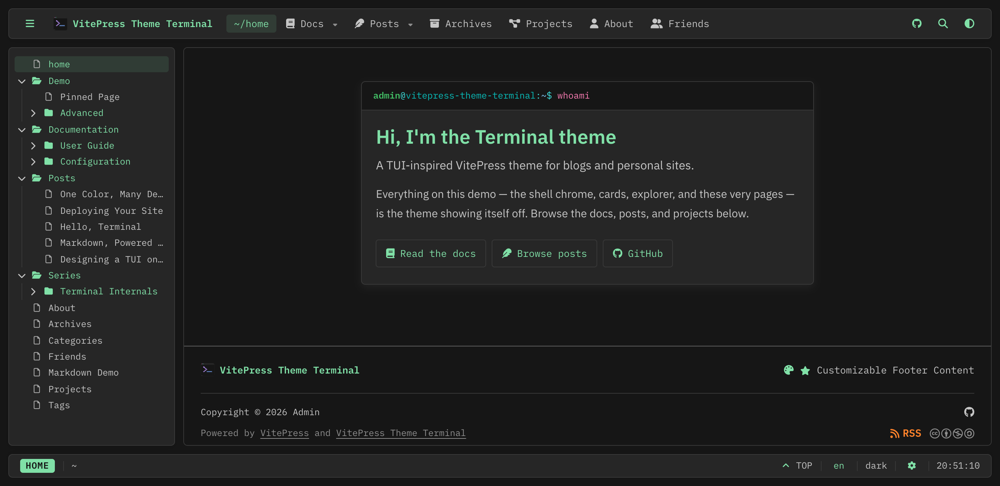

# VitePress Theme Terminal

**English** · [简体中文](README_zh-Hans.md)



A custom [VitePress](https://vitepress.dev) theme for blogs and personal sites
that presents itself as a modern terminal/TUI session: a tool bar, a file
explorer, a scrolling viewport, a status bar, and floating utility windows.
The design language is inspired by modal text editors — panel discipline,
keyboard-centric utilities, and editor chrome — with no third-party branding in
the rendered UI.

## Features

- **TUI shell** — tool bar with nav submenus and an overflow drawer, a
  NeoVim-style file explorer, a live status bar (state chip, breadcrumb, reading
  progress, clock, settings), and floating windows.
- **One color configures everything** — set `mainColor`; every hover, border,
  dim, and selection tone is *derived* from it. IBM Carbon supplies the neutral
  palette, Oxocarbon the syntax colors.
- **Three color modes** — dark (default), light, and a reader-optimized paper
  mode that is also used for printing. The choice is persisted.
- **Blogging** — posts with dates, tags, categories, archives, series, cover
  images, author byline, license card, and Waline comments & view counts.
- **Rich Markdown** — code-block cards with copy, eight callout types, LaTeX
  (MathML) and Typst math, pull quotes, image lightbox and Swiper galleries,
  plus the markdown-it extension suite (footnotes, deflists, abbr, sub/sup,
  ins, mark, emoji).
- **Navigation** — auto-discovered explorer with source-local `explorer.json`
  metadata, resizable and persisted explorer/TOC, heading anchors with
  copy-link, a find palette (`/`), and clean, suffix-free URLs.
- **Internationalization** — client-side language switching with **no
  `/<lang>/` URL segment**: localized frontmatter titles, taxonomy labels, UI
  strings, and even per-language page bodies (`::: lang` blocks). English and
  Simplified Chinese ship built in.
- **Mobile is first-class** — every component adapts, including an explorer
  drawer.
- **Typography** — IBM Plex Sans/Serif/Mono/Math, Font Awesome, and a
  symbols-only Nerd Font, all loaded via stylesheets (no npm font packages).

## Requirements

| Tool | Version | Notes |
| --- | --- | --- |
| Node.js | 20 LTS or newer | What VitePress 2 expects |
| pnpm | any current release | The package manager this repo uses |
| git | any | Optional — the "Updated" date on articles comes from git |

## Quick start

The theme ships **as this repository**: a VitePress site whose theme lives in
`.vitepress/theme/`, with a demo site in `src/` that exercises every feature.

```sh
git clone --recurse-submodules https://github.com/iXORTech/vitepress-theme-terminal.git my-site
cd my-site
pnpm install

pnpm dev       # dev server with hot reload, http://localhost:5173
pnpm build     # production build into .vitepress/dist
pnpm preview   # serve the built site locally
```

`--recurse-submodules` pulls the demo friend-links data; without it the friends
page simply shows its hand-authored entries.

Then make it yours in `.vitepress/config.mts` — site identity, `mainColor`,
author & license, tool-bar nav, and footer. The step-by-step version, including
how to clear out the demo content, is in
[`docs/guide/getting-started.md`](docs/guide/getting-started.md).

## Repository layout

```
.vitepress/config.mts     site + theme configuration — the file you edit most
.vitepress/theme/         the theme implementation (components, styles, composables)
src/                      site content (VitePress `srcDir`) — the demo site
docs/                     documentation home (the only place a document is edited)
src/docs/                 generated copy of the published docs (git-ignored)
AGENTS.md                 instructions for AI coding agents
.agent/                   task board and per-file context cache
```

## Documentation

Everything lives in [`docs/`](docs/index.md). The user-facing part is also
published on the built site at `/docs/`.

| Document | Contents |
| --- | --- |
| [Getting Started](docs/guide/getting-started.md) | Requirements, install, running the site, the five edits that make it yours |
| [Writing Content](docs/guide/writing-content.md) | Page types, frontmatter, code blocks, callouts, math, images, Vue in Markdown |
| [Blogging](docs/guide/blogging.md) | Posts, tags & categories, listing pages, series, covers, end-of-article cards |
| [Navigation](docs/guide/navigation.md) | Tool bar, explorer, TOC, find palette, status bar, keyboard shortcuts |
| [Internationalization](docs/guide/internationalization.md) | Language switching, localizable text, `::: lang` bodies, adding a language |
| [Customization](docs/guide/customization.md) | Colors and modes, fonts and icons, styling rules, custom views and slots |
| [Deployment](docs/guide/deployment.md) | Build & preview, hosting, subpath deploys, CI checkout, pre-launch checklist |
| [`themeConfig` reference](docs/configuration/theme-config.md) · [Frontmatter reference](docs/configuration/frontmatter.md) | Every option, with type, default, and example |

The binding design records under [`docs/design/`](docs/design/) are
repository-only — they are decision records for contributors and coding agents,
and are deliberately not published on the site.

## Contributing

Read [`AGENTS.md`](AGENTS.md) first: it is the single source of the workflow
rules, engineering conventions, and session protocol for this repository — for
humans and AI agents alike. In short: every requirement becomes a task in
[`.agent/plan.md`](.agent/plan.md) before implementation, design decisions are
changed in `docs/design/` before code, styling is SCSS-only, UI strings go
through the locale system, and mobile is not optional.

## License

[MIT](LICENSE) © 2026 iXOR Technology.

That covers the theme itself. The *content* license the theme applies to
articles — CC BY-NC-SA 4.0 by default — is a separate `themeConfig` option for
site owners to set for their own writing.
